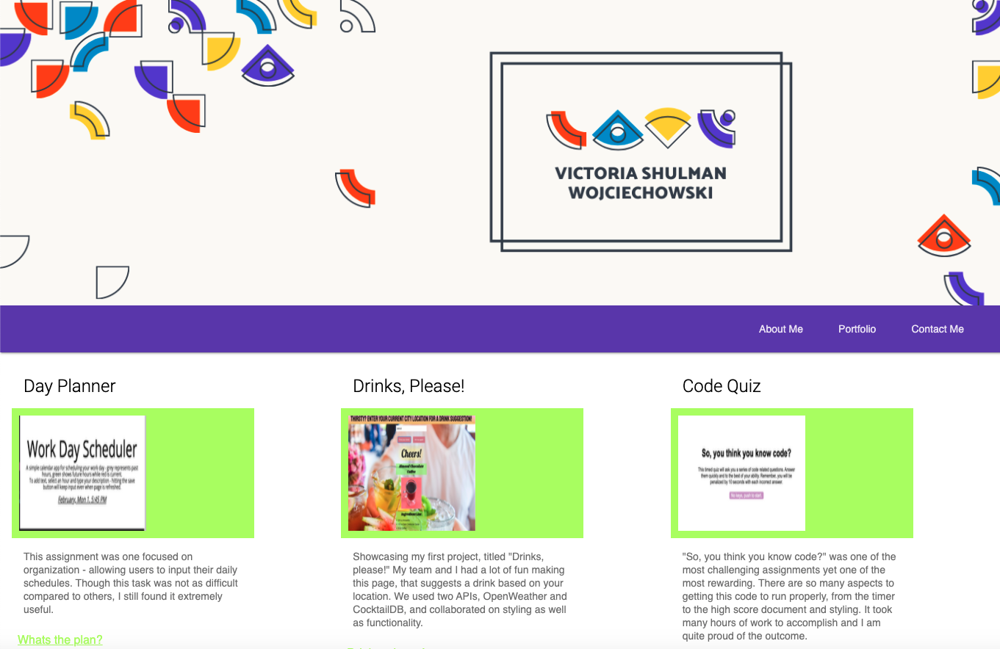
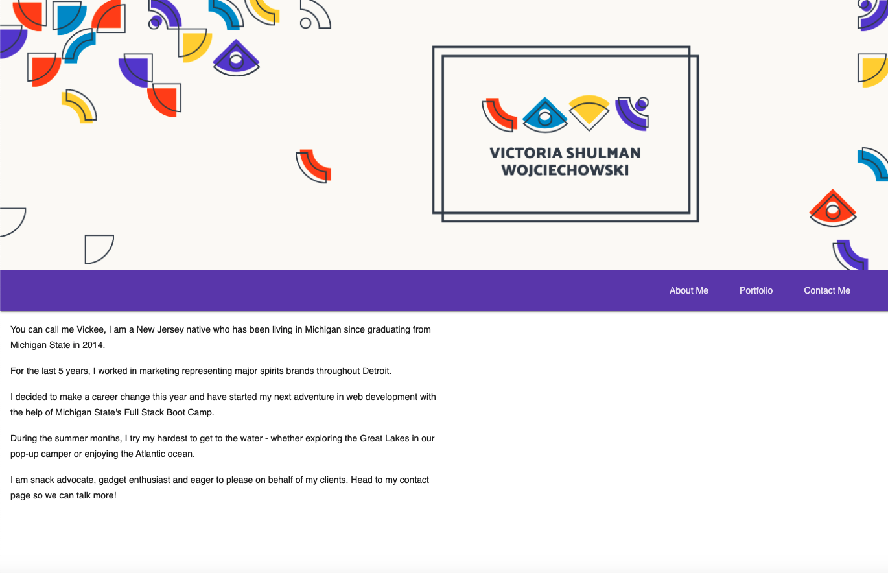

# 09 - Portfolio Update

For this assignment, I was tasked with building my updating portfolio, I am proudly displaying some of assignments from class and will continue developing this portfolio. It is bright and colorful, just like me!

---
## Description 

I changed frameworks for this project, using Material Design Lite - I found it to be very user friendly and efficient. My portfolio is currently responsive, deployed at a live link listed below.

---
## Installation

Use preferred code reader and browser to view HTML, CSS & README files.

---
## Preview 

 

---

## Live Link

(https://vshulman25.github.io/allaboutvick)

---
## Credits

Developer - Victoria Shulman 

---
